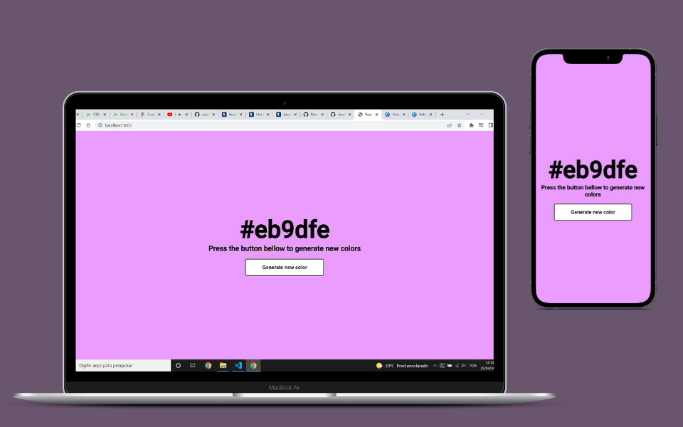

# 
 Color Flipper Challenge by Nuwe 

<strong> Challenge proposed by <strong><a href="https://nuwe.io">Nuwe</a>

  
### 
About the Challenge

Building a <strong> "Color Flipper" </strong> page with a random button. It is a starter project that would help solidify basic concepts like State, Components, Virtual DOM, JSX, CSS and UX.

  
  
### The requested are:
* The layout is seen on the screen;
* Pressing the button automatically generates a new color, changes the background and writes on the screen; 
* Clicking on the hex color copies the clipboard;
* Design responsive;
* UX Design is free to build;
  
## 
Overview

  

* React components;  
* I kept the UX guidelines;  
* Accessibility button "On Click";
* Alert message;  
  

Accessibility
  
  
 
  
  
* Accessibility button with glow;
* Cursor pointer;

React Toast
    
  

  

* You´ll be notification always on clicking on the hex color copies the clipboard;
* Work with React Hot Toast;
* The notification will showing until 0.5s;
* Toast: *Color Copied!* ; 
  

Responsive
  
  

  
  
* @Media 320px - 780px;
  
>## Technology Development

* JSX
* React
* DOM
* CSS3 - Flexbox
* UX/UI

>## Author
*Janaina Bazete (My nickname is Nina).*

**We can talk in my <a href="https://www.linkedin.com/in/janainabazete/">LinkedIn</a>**
  
  
